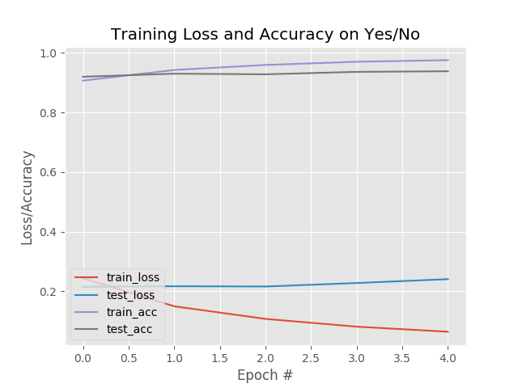

# Yes Or No Image

<p align="right">
    <a href="README_CN.md">中文版</a>
</p>

This project is a learning result of a training on Meachine Learning. It's a simple(**is** or **is not**) image classify framework, using deep learning Convolutional Neural Network, contains tools for:

1. gathering dataset images for training
1. single or batch model training -- this step consume most of your time
1. examine and deploy trained model with http access


## Usage

### Prepare you environment

This project was create with Python 2.7.14, and not checked on Python 3.x

It's recommand to create a virtual environment for the experiment, to keep your local machine clean, to create virtual environment, please check the [User Guide of `virtualenv`](https://virtualenv.pypa.io/en/stable/userguide/).

All required package were listed in the `requirements.txt`, use this command in the root folder of project to install them:

    pip install -r requirements.txt

That's it, you've prepared.

### Gathering dataset images

1. Read the `getDataSet.md`, to obtain URL lists for both **is** and **is not** images
1. Download them into different directories, for a list with name `yes-urls.txt`, the command can be:

    ```sh
    python download_images.py -u yes-urls.txt -o images/yes
    hello from download_images.py
    gonna save to: images/yes
    file line count: 10
    url count: 6
    [INFO] downloaded: images/yes/00000005.jpg
    [INFO] downloaded: images/yes/00000000.jpg
    [INFO] downloaded: images/yes/00000002.jpg
    [INFO] downloaded: images/yes/00000003.jpg
    [INFO] downloaded: images/yes/00000001.jpg
    [INFO] downloaded: images/yes/00000004.jpg
    3 in 6 files removed.
    ```
1. Do the same on the `no-urls.txt`, only save them into another directory aside `yes`
1. Check all your dataset images, to remove invalid images, non-target image in `yes` directory, and target image in other directories.

#### Note:

* The only **MUST BE** directory name is `yes`, it'll be used by the training step to determine the target object, the others directory can be `no` or anything you want.
* The downloader script will remove those invalid images if they:
    1. Can not be `imread` by cv2
    1. Have a same MD5 hash value with existing image

### Training your Neural Network

The Neural Network was defined in the **nn/mycnn.py**, you should edit it or use another python module to **create your own Neural Network**, don't forget to edit `train_network.py` for importing Neural Network from your own module, if you do have your own module.

To train your network can use the `train_network.py` with this command:  

```shell
python train_network.py -d images/ -m guitar_model
```

after training, if you didn't changed the default output path, the model will be stored in folder `output`, along the training information plot image:  


Or you can edit the `batch_train.py`, all editable variables are obvious, just insert your desired values,  and the command is a little shorter:

```shell
python batch_train.py
```

the models stored in the same output location of `train_network.py`, but with this script, you get all models with combination of those variables, I just run this command and sleep, and check the result plot images on the morning.

### Testing and deploy your trained model


#### Testing on the command line

To test the trained model, you can use the `test_network.py` script, just specify the **trained model**, **yes label**, and **image for testing**:

```shell
python test_network.py  -m output/guitar -l Guitar -i images/testing/no/00000200.jpg
Using TensorFlow backend.
[INFO] loading network...
prob is:0.99967110157, 0.000328877591528
Not Guitar: 99.97%
```

you can read the probability of both `yes` and `no` on the command line, and the label choosed by model on the result image like this:  

to close the image, click on the image, and press any key on the keyboard.

* If you choosed a different `train_image_size` other then default value `28`, don't forget to specify it with the option `-s`.

#### Testing with web interface and use it to deploy

It's tolerable to test with command line, but not convenient, to drag & drop image for testing, you can use the `web_test.py` script:

```shell
python web_test.py -m output/guitar_EPOCHS5_LR0.001_BS32_TIS28_DSS1952 -l Guitar
```

The options are same as `test_network.py`, just no **image path** needed, and this start a web server on `http://127.0.0.1:5000/`, open it with your favourite web browser, just drag a test image, and drop in to the **red square** with `Drop Here` in it, the result image will be shown on the right side of it.

#### Deploy the model

With the `web_test.py` script, we have a web server listening on the `5000` port on the localhost interface, the only thing you need to publish it is a reverse proxy server like Nginx or Apache, that's beyond the topic of this project, please search and check related documents.

## Referenced tutorial
* [How to create a deep learning dataset using Google Images](https://www.pyimagesearch.com/2017/12/04/how-to-create-a-deep-learning-dataset-using-google-images/)
* [Image classification with Keras and deep learning](https://www.pyimagesearch.com/2017/12/11/image-classification-with-keras-and-deep-learning/)

I can't understand these tutorials Without the knowledge learning from this training, the core concept of this project is the same as those tutorials, but I adapted them, to make it generic, not only used on the **Santa Clause** recognizing.