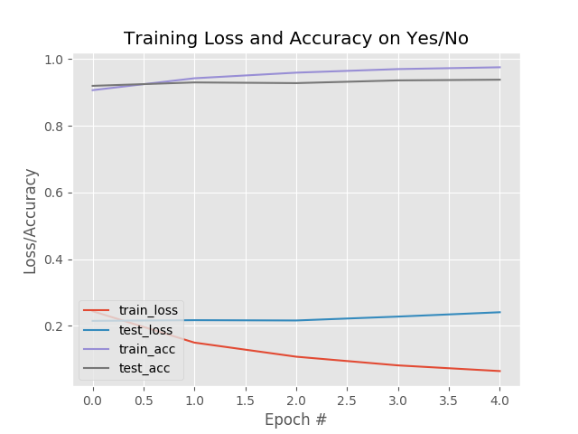
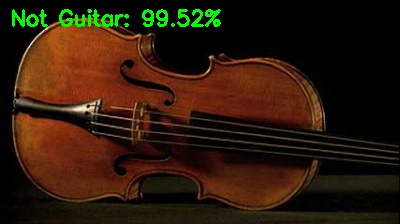

# 图辨是非

本项目是关于机器学习培训的结果，是一个简单的（**是**或**非**）图片分类器框架，使用深度学习的卷积神经网络，其中的工具可用于：

1. 为训练收集数据
1. 单次或批量地训练模型 -- 这是主要时间开销的步骤
1. 检验及部署作为训练结果的模型，并提供http访问


## 使用方法

### 准备开发环境

此项目在 python 2.7.14 下开发，未在 python 3.x 下进行过测试。

建议为此次尝试创建一个独立的虚拟环境，以确保不影响你本机环境，创建虚拟环境的方法，请参阅 [User Guide of `virtualenv`](https://virtualenv.pypa.io/en/stable/userguide/).

本项目所需的所有包，都列于 `requirements.txt` 文件中，在项目的根目录使用以下命令进行安装：

    pip install -r requirements.txt

准备工作至此结束。

### 收集数据集图片

1. 请阅读 `getDataSet.md`, 以获取 **是** 和 **非** 类别图片的链接列表
1. 把图片下载到对应的目录里，对于名为 `yes-urls.txt` 的链接文件，可使用如下命令:

    ```sh
    python download_images.py -u yes-urls.txt -o images/yes
    hello from download_images.py
    gonna save to: images/yes
    file line count: 10
    url count: 6
    [INFO] downloaded: images/yes/00000005.jpg
    [INFO] downloaded: images/yes/00000000.jpg
    [INFO] downloaded: images/yes/00000002.jpg
    [INFO] downloaded: images/yes/00000003.jpg
    [INFO] downloaded: images/yes/00000001.jpg
    [INFO] downloaded: images/yes/00000004.jpg
    3 in 6 files removed.
    ```
1. 对 `no-urls.txt` 执行对应对操作, 使之保存在 `yes` 对同级目录里
1. 查阅你数据集里所有对图片，剔除无效图片，`yes` 目录里的非目标图片，和其它目录里的目标图片。

#### 注意:

* 唯一 **必须使用** 的目录名是 `yes`，它会在训练步骤里，用来判定目标图片，其它目录可以用  `no` 或其它任意的名字。
* 下载器脚本会删除符合以下特征的无效图片：
    1. 无法被 cv2 包通过 `imread` 读取
    1. 与任一现存图片具有相同对 MD5 摘要值

### 训练神经网络

神经网络定义在文件 **nn/mycnn.py** 中，你可以编辑它或者用另一个模块以 **创建你自己对神经网络**，如果你使用自己的模块，别忘记编辑文件 `train_network.py` 以便从你自己对模块导入神经网络。

要训练神经网络，请通过以下命令使用脚本文件 `train_network.py`：

```shell
python train_network.py -d images/ -m guitar_model
```

训练完成后，如果你没有修改默认对输入路径，模型会保存在 `output` 文件夹下，同时还有包含训练过程信息的图片：


你也可以编辑脚本文件 `batch_train.py`，可编辑的变量都是自解释的，只要填入你想使用的值即可，命令比刚才稍短：

```shell
python batch_train.py
```

模型保存位置与脚本文件 `train_network.py` 的输出一致，但是，通过这个脚本，你得到的是那些变量的可能组合产生的所有模型，我一般睡觉之前运行这个命令，第二天早上查看所有的结果。

### 测试并部署训练好的模型


#### 在命令行下测试

要测试训练好的模型，可以使用 `test_network.py` 脚本，只需要指定 **目标模型**、**`是`标签**，和 **待测试图片路径**：

```shell
python test_network.py  -m output/guitar -l Guitar -i images/testing/no/00000200.jpg
Using TensorFlow backend.
[INFO] loading network...
prob is:0.99967110157, 0.000328877591528
Not Guitar: 99.97%
```

你可以在命令行对输出中看到 `yes` 和 `no` 各自的可能性数值，还能在结果图中看到模型选定的标签，如下图：

要关闭图片显示，请在图片上点击鼠标，然后按下键盘上对任意按键。

* 如果你在训练步骤中，指定了 `train_image_size`，而没有使用默认的 `28`，别忘记通过 `-s` 选项指定它。

#### 以 web 界面测试并部署

通过命令行界面测试尚可忍受，只是稍有不便，想通过拖拽图片对方式进行测试，可以用 `web_test.py` 脚本：

```shell
python web_test.py -m output/guitar_EPOCHS5_LR0.001_BS32_TIS28_DSS1952 -l Guitar
```

命令选项跟 `test_network.py` 相同，只是不需要再指定 **图片路径** 了，这个脚本启动了一个监听在 `http://127.0.0.1:5000/` 上的 web 服务器，在你常用的浏览器里打开它，拖拽一张图片到写有 `Drop Here` 的 **红色方框** 里，结果图片会显示在它的右侧。

#### 部署模型

使用 `web_test.py` 脚本，就得到了一个监听在回环地址上 `5000` 端口的 web 服务，要发布它，唯一的依赖就是一个反向代理服务器，比如 Nginx 或者 Apache，不过这超出了本项目的主题，请搜索并参阅相关文档。

## 参考教程
* [如何使用 Google 图片创建深度学习的数据集](https://www.pyimagesearch.com/2017/12/04/how-to-create-a-deep-learning-dataset-using-google-images/)
* [使用 Keras 和深度学习进行图片分类](https://www.pyimagesearch.com/2017/12/11/image-classification-with-keras-and-deep-learning/)

如果没有通过这次培训学到的知识，我就无法理解上面的两个教程，本项目对核心思想与教程一致，我只是改写了它们，使其功能泛化，而不仅仅应用于 **圣诞老人** 的识别。
